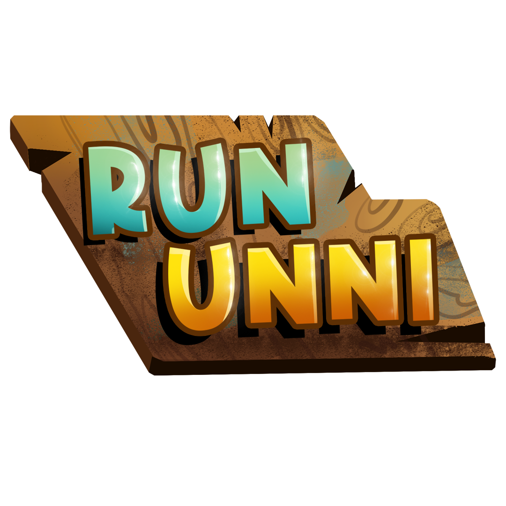

# Run Unni

# License

## Source Code
The rest of the source code in this repository is licensed under the MIT License.

## 1. Images and Media Files

© 2025. All images and media files in the `assets` directory are licensed under the [Creative Commons CC BY 4.0](https://creativecommons.org/licenses/by/4.0/), unless otherwise specified.

The BGM [Comedy Music (Funny Quirky Cunning Silly Background Intro Theme)](https://pixabay.com/music/happy-childrens-tunes-comedy-music-funny-quirky-cunning-silly-background-intro-theme-274541/) and sound effects (`assets/game/audio/forest-bgm.mp3`, `assets/game/story/transition.mp3`, `assets/game/story/noise.mp3`, and `assets/game/story/shutter.mp3`) were sourced from [Pixabay](https://pixabay.com/) and are used in accordance with the [Pixabay Content License](https://pixabay.com/service/license-summary/).

## Attributions

1. BGM: [Comedy Music (Funny Quirky Cunning Silly Background Intro Theme)](https://pixabay.com/music/happy-childrens-tunes-comedy-music-funny-quirky-cunning-silly-background-intro-theme-274541/)
   Licensed under the [Pixabay Content License](https://pixabay.com/service/license-summary/)
